# Makoquiz — 即時搶答互動簡報平台

主持人在大螢幕出題，參與者用手機掃 QR Code 加入作答，答對越快分數越高，並可即時提問。

**Nuxt 4 + Nitro + Socket.IO**。

📖 **完整說明文件：[maxx541.github.io/mako-quiz](https://maxx541.github.io/mako-quiz/)**


<p align="center">
  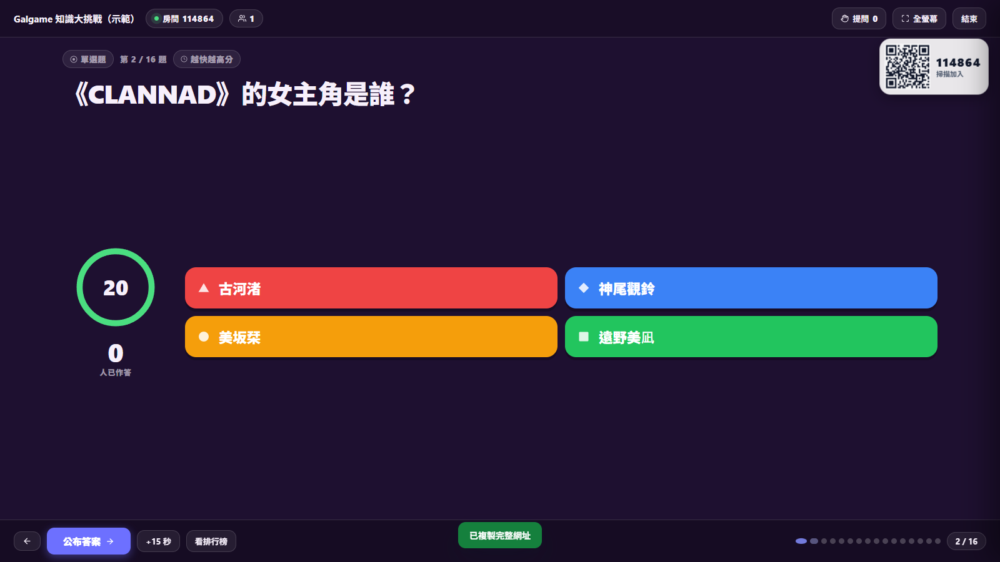
</p>

<table>
  <tr>
    <td width="33%"><br><sub><b>大廳等待</b>：房號 + QR，掃描即加入</sub></td>
    <td width="33%">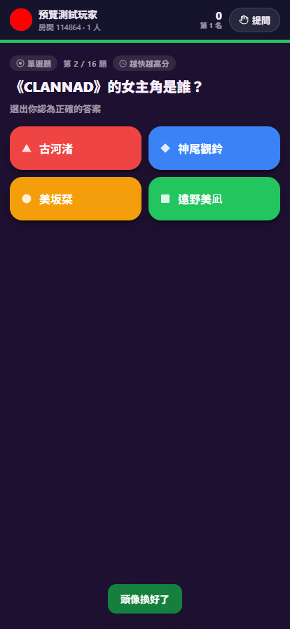<br><sub><b>手機作答</b>：不用註冊，填暱稱就進來</sub></td>
    <td width="33%">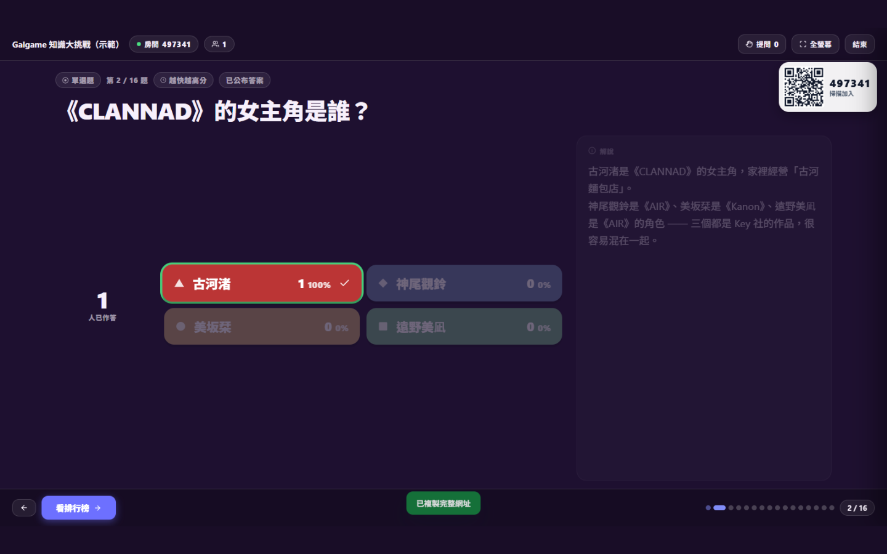<br><sub><b>公布答案</b>：即時長條圖動畫</sub></td>
  </tr>
  <tr>
    <td>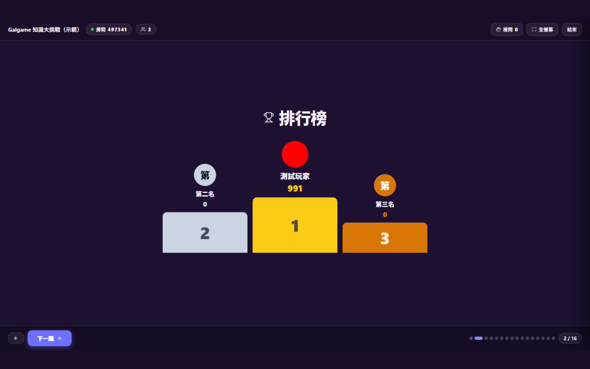<br><sub><b>排行榜</b>：答對越快分數越高</sub></td>
    <td>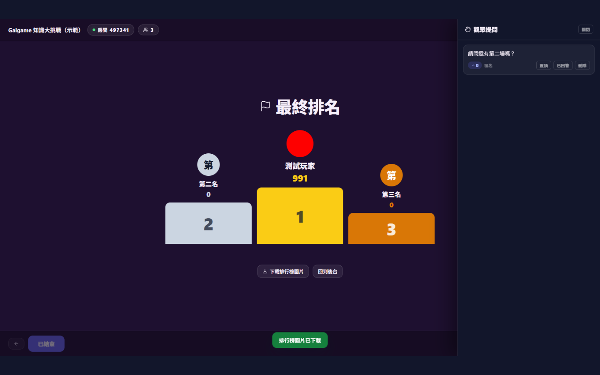<br><sub><b>頒獎台</b>：金銀銅逐名揭曉</sub></td>
    <td>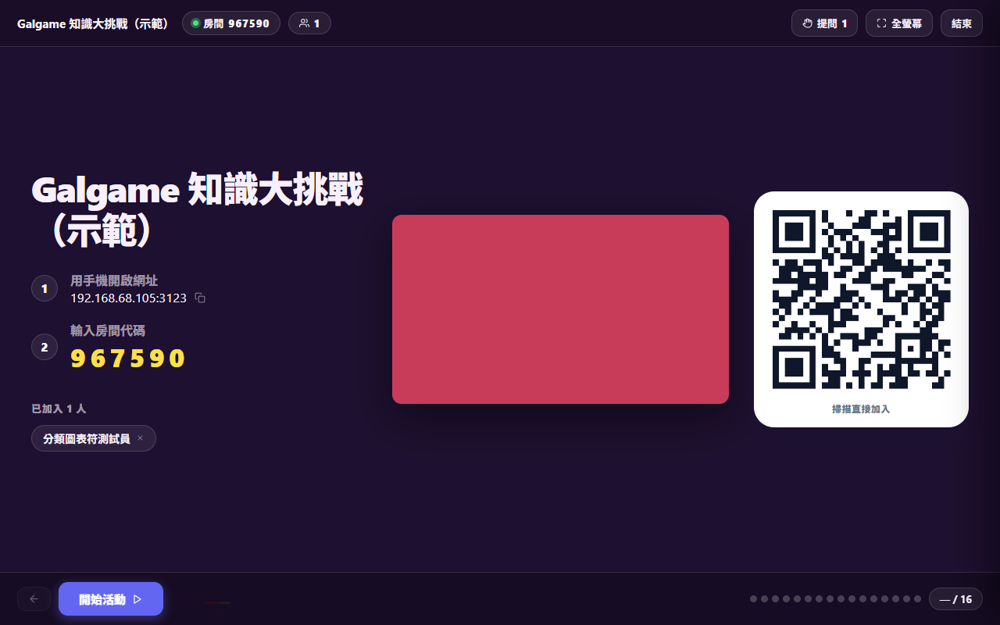<br><sub><b>表情符號</b>：匿名浮出、自動淡出</sub></td>
  </tr>
  <tr>
    <td>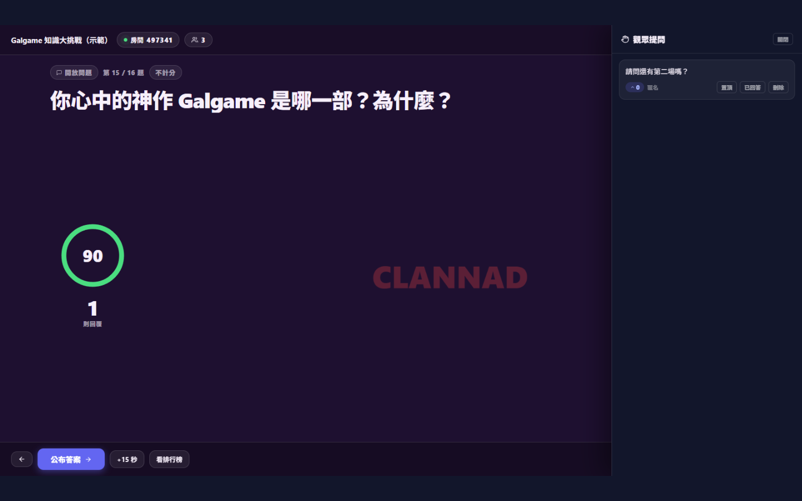<br><sub><b>文字雲</b>：開放問題即時彙整</sub></td>
    <td>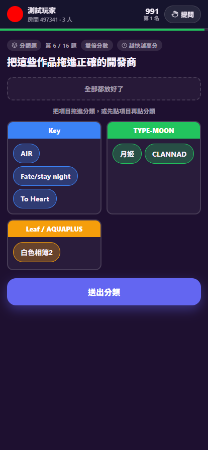<br><sub><b>分類題</b>：手指拖曳，觸控也能玩</sub></td>
    <td>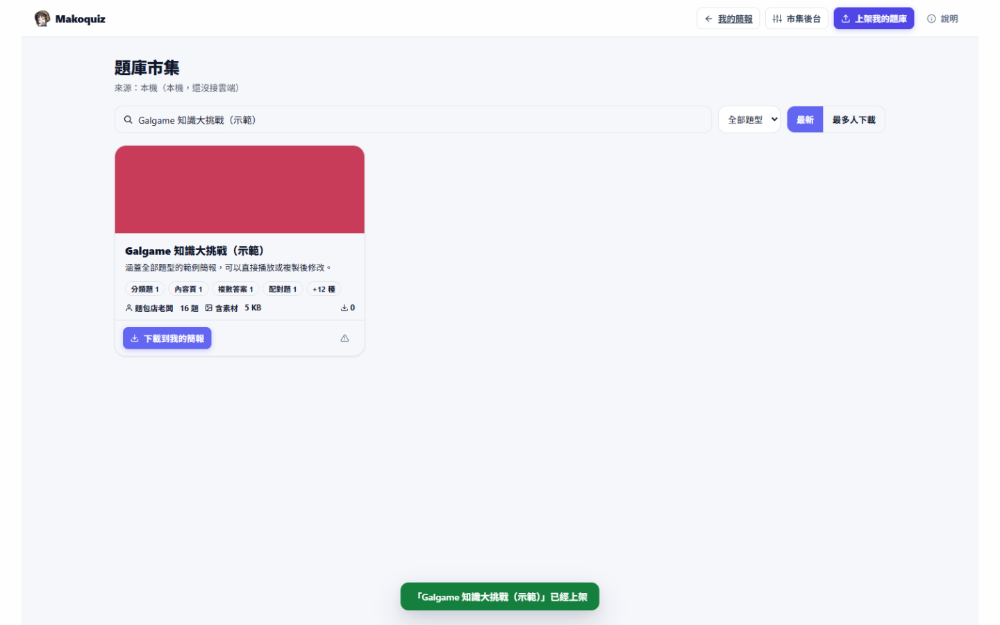<br><sub><b>題庫市集</b>：下載、上架、共用題庫</sub></td>
  </tr>
  <tr>
    <td>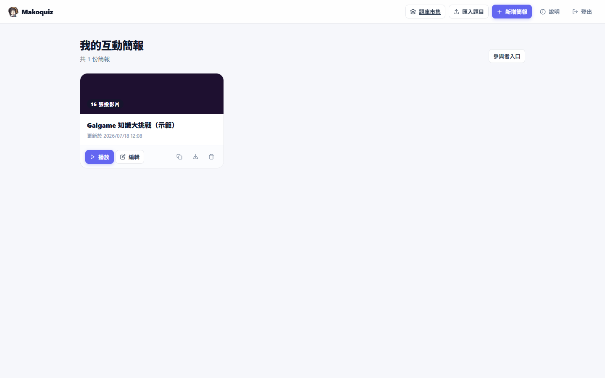<br><sub><b>管理後台</b>：簡報列表與匯入匯出</sub></td>
    <td>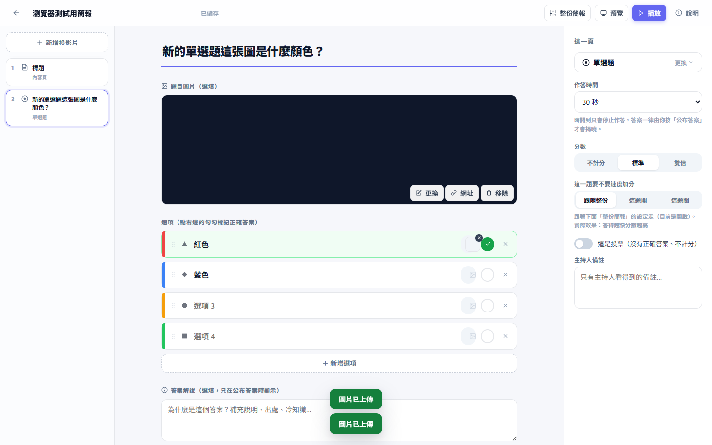<br><sub><b>編輯器</b>：左投影片／中出題／右設定</sub></td>
    <td></td>
  </tr>
</table>

---

## 目錄

- [快速開始（三步驟）](#快速開始三步驟)
- [操作手冊](#操作手冊)（辦一場活動、題庫市集）
- [題型（15 種）](#題型15-種)
- [讓 AI 幫你出題](#讓-ai-幫你出題)
- [接上 Supabase（選用）](#接上-supabase選用)
- [環境變數](#環境變數)
- [架構](#架構)
- [測試](#測試)
- [授權](#授權)

---

## 快速開始（三步驟）

需要 **Node.js 22.12 以上**（[nodejs.org](https://nodejs.org) 下載 LTS 版）。

```bash
git clone <你的-repo-網址>
cd Galgame搶答網站
npm install
npm run build
npm start          # → http://localhost:3000/admin （預設密碼 admin123）
```

> 💡 **一開起來就有題目可玩**：第一次啟動偵測到還沒有任何簡報時，會自動建立一份
> 涵蓋全部 15 種題型的示範簡報「**Galgame 知識大挑戰（示範）**」，可以直接播放，
> 或複製一份改成自己的內容。想從乾淨狀態開始，把 `data/presentations.json` 刪掉再啟動即可。

**Windows 使用者可以更省事**：不用碰終端機，直接雙擊 **`啟動.bat`** ——
它會自動裝相依套件、建置、開一條 cloudflared 對外通道（第一次會自動下載 cloudflared）、
帶著網址啟動伺服器並打開後台。詳見下面的[操作手冊](#操作手冊)。

| 入口 | 網址 | 給誰 |
| --- | --- | --- |
| 管理後台 | `http://localhost:3000/admin` | 主持人（出題、播放） |
| 參與者 | `http://localhost:3000/` | 觀眾（輸入房號加入） |
| 題庫市集 | `http://localhost:3000/gallery` | 逛題庫、下載、上架 |

想接雲端題庫市集 → 複製 `.env.example` 成 `.env` 再填 Supabase 金鑰，見
[接上 Supabase](#接上-supabase選用)。

---

# 操作手冊

## 第一次使用

需要 **Node.js 22.12 以上**（[nodejs.org](https://nodejs.org) 下載 LTS 版，一路下一步）。
裝好後在專案資料夾開一次終端機：

```bash
npm install
```

之後就再也不用碰終端機了。

## 辦一場活動

### 1. 開起來

**雙擊 `啟動.bat`。** 它會自己做完這些事：

1. 檢查相依套件（第一次會自動 `npm install`）
2. 原始碼有改過才重新建置（沒改就跳過，幾秒就開好）
3. 開一條 cloudflared 臨時通道，拿到一個對外網址（**第一次會自動下載 cloudflared，約 50 MB，只下載這一次**）
4. 帶著那個網址啟動伺服器（QR code 才會指向它）
5. 自動開瀏覽器到後台

畫面會長這樣：

```
==> 建置產物是最新的，跳過 build
==> 建立 cloudflared 暫時通道
==> 啟動伺服器

  Makoquiz 已啟動
  後台   http://localhost:3000/admin
  對外   https://bit-funky-alto-grams.trycloudflare.com
         QR code 會自動指向這個網址
```

> **臨時通道的網址每次啟動都不一樣**，所以不能事先把網址發給參加者 ——
> 開起來之後再公布，或直接讓他們掃 QR。

常用參數（在 `啟動.bat` 後面加）：

| 參數 | 作用 |
| --- | --- |
| `-Port 3100` | 換埠號，預設 3000 |
| `-NoTunnel` | 不開通道，QR 只指向區網 IP（同一個 wifi 才連得到） |
| `-Rebuild` | 強制重新建置 |
| `-NoOpen` | 不要自動開瀏覽器 |

### 2. 登入後台

預設密碼 **`admin123`**。要改的話見下面的「環境變數」。

### 3. 出題

後台 → **新增簡報** → 進編輯器。左邊是投影片列表、中間出題、右邊設定。

- **左欄標「待完成」** = 這一頁還缺東西（沒填題目、沒標正解、音樂題沒音檔…）
- **會自動存**，右上角會顯示「已儲存」
- 懶得自己想題目：後台 → 匯入題目 → **複製出題指南** → 貼給 ChatGPT / Claude
  再說一句主題，把它吐出來的 JSON 貼回來就好

### 4. 先預覽（建議）

編輯器右上角 **預覽** —— 會開一場真的預覽場次，左邊是大螢幕、右邊是手機，
可以直接按下去試。關掉就自動收乾淨。

### 5. 播放

編輯器或後台卡片的 **播放**。按下去之前會先掃一遍有沒有缺漏，有的話會列出來問你
要不要繼續（堅持要播就讓你播）。

大螢幕操作：

| 動作 | 怎麼做 |
| --- | --- |
| 下一步（開始／公布答案／看排行榜／下一題） | `空白` 或 `→`，或按藍色主按鈕 |
| 上一步 | `←` |
| 全螢幕 | `F` |
| 提問面板 | `Q` |
| 跳到某一題 | 點下方的小圓點 |

### 6. 參與者加入

叫他們掃大螢幕的 QR，或開那個對外網址、輸入 6 位數房號。**不用註冊**，填個暱稱就進來。

- 大廳可以**上傳頭像**（開打之後就不給換了）
- 答題中 QR 會縮在右上角，晚到的人隨時掃得進來

### 7. 進行中

- **全員答完會自動公布**，不用等你按（海龜湯和猜圖題例外，那兩種要你按）
- 時間到只會鎖定作答，**不會自動公布** —— 留給你講評的空間
- `+15 秒` 可以加時，加時會重新開放作答
- 猜圖題／海龜湯可以手動 `揭露下一階段`

### 8. 結束

大螢幕右上角 **結束** → 最終排名（逐名揭曉，點畫面可以跳過）→
**下載排行榜圖片**（直式 JPG，適合丟群組）→ **回到後台**。

---

## 題庫市集

後台右上角 **題庫市集**。逛別人做的題庫、下載回來變成自己的、把自己的上架分享。

- **下載** → 直接變成你的簡報並跳進編輯器，之後隨你改
- **上架** → 填個製作者名稱就好，不用註冊
- **想拿掉自己上架的東西** → 跟市集管理員說一聲，刪除一律由管理員處理
- 沒設定 Supabase 的話，市集是**本機的**（只有你自己上架的東西），程式一切正常

接雲端的做法見下面「接上 Supabase」。

---

## 一般啟動（給開發用）

```bash
npm run dev          # 開發模式（含 HMR）
npm run build && npm start
```

| 入口 | 網址 |
| --- | --- |
| 參與者 | `http://localhost:3000/` |
| 管理後台 | `http://localhost:3000/admin` |
| 題庫市集 | `http://localhost:3000/gallery` |
| 手機（同網段） | 用啟動時顯示的區網 IP；QR Code 會自動指向它 |

後台預設密碼 `admin123`，用環境變數修改：

```powershell
$env:NUXT_HOST_PASSWORD="你的密碼"; $env:PORT="3000"; npm run dev
```

第一次啟動會自動建立一份涵蓋全部題型的示範簡報。

## 題型（15 種）

| 題型 | 說明 | 計分 |
| --- | --- | --- |
| 單選題 | 一個正確答案；關掉正解就變成投票 | 對／錯 |
| 複選題 | 多個正確答案，選錯會抵銷選對 | 部分給分 |
| 是非題 | 快速二選一 | 對／錯 |
| 配對題 | 左右兩欄配對，右欄在每支手機上亂序 | 每組各給分 |
| **分類題** | 把項目拖進正確的分類，放對幾個算幾分 | 部分給分 |
| 順序題 | 依序點選項目，自動編上 1、2、3、4 | 每個位置各給分 |
| 填空題 | 自行輸入，可設定多組可接受答案 | 對／錯 |
| **數字題** | 猜數字，越接近答案分數越高 | 依接近程度 |
| **海龜湯** | 一階段給一條提示，每出新提示就能再猜一次 | 依階段 |
| **猜圖題** | CG／立繪分階段揭露，越早猜中越高分 | 依階段 |
| **音樂題** | 大螢幕播放音樂，參與者選答案 | 對／錯 |
| **評分題** | 1~N 分量表，看平均與分布 | 不計分 |
| 開放問題 | 自由發表，即時文字雲或回覆列表 | 不計分 |
| 觀眾提問 | 參與者提問＋互相按讚，主持人置頂／標記已回答 | 不計分 |
| 內容頁 | 純文字說明頁，用來開場或分段 | 不計分 |

**題目與選項都可以放圖片**（PNG / JPG / GIF / WebP，5 MB 以內）。
圖片題在大螢幕上會佔到 46% 的高度，猜圖題則整個舞台都給圖。

### 用外部網址

圖片與音樂題的音檔除了上傳，也可以**直接貼網址**（圖片框的「或貼上圖片網址」、
音檔的「或貼上音檔網址」）。要貼**檔案本身的直接連結**（`.png`、`.mp3` 那種），
不是網頁網址（YouTube 連結沒有用）。

| | 上傳 | 貼網址 |
| --- | --- | --- |
| 檔案在誰家 | 你的 `data/uploads/` | 別人的伺服器 |
| 對方砍檔會怎樣 | 不會怎樣 | **你的題目開天窗** |
| 匯出／上架 | 會打包進 zip | 不打包，原樣帶走 |
| 佔不佔市集的 50 MB | 佔 | **不佔** |

所以：**正式活動建議上傳**（檔案握在自己手上）；**音樂題想省上架額度**時貼網址很划算 ——
整包題目簡報上限 50 MB，幾首 MP3 就吃掉一大半。用網址的地方會標「外部網址」提醒你。

### 封面

後台的簡報卡片與市集的題庫卡片都會顯示封面，用的是**第一張有配圖的投影片**
（內容頁的圖、猜圖題的 CG、題目圖都算）。

刻意**不拿解說圖當封面** —— 那張圖常常直接畫著答案，拿去當封面等於在列表上爆雷。
市集的封面是上架時就抽出來另存的，逛市集不用為了一張縮圖去下載整包 zip。

### 猜圖題（CG／立繪）

上傳一張圖，設定分幾階段揭露，大螢幕就會慢慢把圖露出來：

- **揭露方式**：`格子揭開`（一塊一塊掀開）／`由糊變清`／`由近拉遠`
- **階段數**：3~8 段；每階段可設定停留幾秒自動揭下一段，也可以只由主持人手動按
- **計分**：第 1 階段猜中拿 100%，最後一階段剩 40%，中間平均遞減
  （這類題目的樂趣就是「敢不敢早點賭」，所以用階段取代速度加分）
- 圖片**只在大螢幕上**，不會送到參與者手機——手機端只拿得到選項
- 公布答案時圖片一定全開

#### 自己排每階段要揭哪幾塊

格子模式可以在編輯器裡把圖切成格線（列 2~10、行 2~12），
再一個階段一個階段點格子，指定「這一階段要新揭開哪幾塊」——
想先露眼睛、最後才露臉就這樣排。

- 每一塊只屬於一個階段（它第一次被揭開的那個），所以第 k 階段看到的是第 1~k 階段的聯集，揭開的不會再蓋回去
- 沒排到的格子會留到公布答案才出現
- **完全不排**就是自動揭露：依題目 ID 推導出一組固定的順序，每階段揭一批
  （所以主持人畫面和每支手機看到的進度完全一致）
- 改格數會讓已排的索引失去意義（索引是 `列 × 行數 + 行`），所以會清空重排

### 音樂題

上傳音檔（MP3 / OGG / WAV / M4A / FLAC，15 MB 以內），大螢幕播放並顯示音波動畫。
可設定從第幾秒開始播（跳過前奏）與是否自動播放。音檔只在大螢幕播，不傳到手機。

### 數字題

設定答案與容許誤差。剛好猜中滿分；差距越大分數線性遞減，超過容許誤差 0 分。
公布時大螢幕會顯示正確答案、平均猜測、最接近的前 5 名。

### 海龜湯

一階段給一條提示（例如「作品類型是廢萌作」→「開發商是 Key」→「女主角家裡開麵包店」），
參與者自己打答案：

- **每出一條新提示就能再猜一次** —— 先賭一把，猜錯了等下一條提示再修正
- 同一條提示只能猜一次；答對之後就鎖定，不能再改
- 答案可以設多組寫法（繁體／簡體／英文／通稱），符合任一個就算對
- 計分同猜圖題：第 1 條提示就猜中拿 100%，看到最後一條才猜中剩 40%

### 分類題

給定幾個分類欄位，參與者把項目拖進他認為對的分類，放對幾個就拿幾分（部分給分）。
手機端用 Pointer Events 做拖曳，觸控也能拖。項目屬於哪個分類**不會下發到手機**——那就是答案。

### 圖片放大

大螢幕右側的解說圖、參與者手機上的題目圖與解說圖，都可以**點一下放大**看清楚
（點任一處或按 Esc 關閉）。主持端放大時的鍵盤事件會被攔下來，不會穿透過去把簡報翻頁。

## 自訂表情符號

管理端可以上傳自己的表情符號（最多 12 個）。參與者點一下，大螢幕就會從下方浮出來、
飄升幾秒後淡出，**不會顯示是誰送的**——匿名大家才敢按。

- 廣播內容只有 `id` / `url` / 流水號三個欄位，不含任何身分資訊（有測試盯著）
- 每人每 700ms 最多送一個，避免洗版
- 主持人可以隨時關閉整個功能

## 配對／順序／分類題的圖片

配對題左右兩欄的每一格，順序題與分類題的每個項目，都能放圖，也可以**只放圖不放字**
（最常見的用法：左邊角色立繪配右邊角色名、把 CG 依劇情先後排、把立繪分到所屬作品）。

排版上的取捨：

- 圖一律 `object-fit: contain`，**絕不裁切**。看圖配對時被裁掉的往往正是要辨認的那個細節。
- 去背 PNG 底下墊一層深色，透明的立繪才不會糊進卡片背景。
- 圖片大小**跟著組數縮放**：手機兩欄各 N 格，8 組就是 16 張圖，不縮小的話整頁都在捲。
- 大螢幕在「有圖且超過 4 組」時**自動排成兩欄**。實測 1366×768 的投影機列表區只有 628px 高，
  8 組排一欄每張圖只剩 40px —— 那就等於沒有圖；兩欄變 4 列，同樣高度可以放到 84px。
- 配對題右欄的圖跟文字一樣**跟著洗牌後的位置走**，一樣只給 token，`pairId` 不下發。
- 順序題的 `items` 原始順序**就是答案**，所以下發到手機前一定要洗牌 ——
  圖片跟著自己的項目走，不會因為多了圖就把順序漏出去（有測試比對手機上的順序與正解）。
- 分類題的 `categoryId` **就是答案**，一樣不下發；圖片跟著項目走，拖曳時**跟著手指跑的浮動元素也會帶圖**
  （純圖片的項目拖起來不能是一塊空白）。分類框是窄欄，裡面的圖會自動比項目池小一號。
- 手機公布答案那一行是純文字：純圖片的項目寫不進去，就用「（圖片）」代替；
  整題都是圖的話「正確答案」整塊不顯示 —— 大螢幕上本來就看得到圖，不需要硬湊一行沒用的字。

## 封面圖

列表、題庫市集、還有**大廳等人的時候**都用同一張。規則只有一條：

1. 作者在「整份簡報 → 封面」自己指定的那張
2. 沒指定就自動抓**第一張有配圖的題目**

自動抓的時候只看 `slide.image`，**不碰解說圖** —— 解說圖常常直接畫著答案，
拿它當封面等於在列表上爆雷。這條規則寫在兩個地方（`store.ts` 的 `coverOf()`
給本機用、`bundle.ts` 的 `findCover()` 給市集上架用），兩邊必須一致。

大廳的版面是「加入資訊 ｜ 封面 ｜ QR」三欄；沒有封面就退回原本的兩欄，不會留一塊空白。

## 按鈕音效

主持人控制列的按鈕可以有音效。音檔放在 **`data/sounds/`**（不是 `public/`）——
換一顆音效只要換檔案，不用重新 build，也不會在下次 build 被蓋掉。

檔名是固定的，副檔名 `.mp3` / `.ogg` / `.wav` / `.m4a` / `.flac` 都認：

| 檔名 | 哪一顆按鈕 |
| --- | --- |
| `advance.*` | 主要按鈕：開始活動／下一題／下一頁 |
| `reveal.*` | 公布答案（沒放這個檔就用 `advance.*`） |
| `back.*` | 上一步 |
| `stage.*` | 揭露下一階段／給下一條提示 |
| `addtime.*` | ＋15 秒 |
| `leaderboard.*` | 看排行榜 |

- **放進去就會生效**，重新整理主持人頁面即可（伺服器每次都重掃資料夾，不用重開）。
- **沒放的檔案就是沒有聲音**。不想要某顆按鈕出聲，把檔案刪掉就好 ——
  前端只會去載「真的存在」的檔案，不會在 console 留一排 404。
- 鍵盤快捷鍵（空白鍵／方向鍵）跟按鈕是同一套動作，音效也一樣。
- 資料夾第一次開機會自動建好，裡面附一份 `讀我.txt` 寫著上面這張表。

## 背景音樂（大廳音樂／作答音樂）

兩首各自獨立，都在編輯器的 **整份簡報** 裡設定，也**都只在主持人的大螢幕播**——
跟猜圖題的圖、音樂題的音檔一樣，網址不會下發到手機，參與者那端不會有聲音。

| | 什麼時候響 | 怎麼開始 |
| --- | --- | --- |
| **大廳音樂** | 等待參與者加入時 | 主持人在大廳按播放鍵；開始出題就自動收掉、停播 |
| **作答音樂** | 開始出題後整場循環 | 自動接上；主持人可用控制列的音符鍵隨時關掉 |

作答音樂的細節：

- **碰到音樂題自動讓路**，離開那一頁再自己接回去——兩首音檔不會疊在一起響。
- 頒獎（最終排名）畫面會停下來，把場子留給掌聲。
- 可調**音量**（預設 35%），建議 30–40%：背景音樂太大聲會蓋掉主持人講話。
- 主持人手動按掉之後**不會被換頁自動接回來**，得再按一次才會放。

## 計分與速度加分

標準 1000 分、雙倍 2000 分，乘上答對比例。

**速度加分**（答對越快分數越高）有**兩層**，兩個開關在編輯器的不同區塊：

| 位置 | 標籤 | 作用 |
| --- | --- | --- |
| 右側「這一頁」 | 這一題要不要速度加分 | 只覆寫這一題：跟隨整份／這題開／這題關 |
| 右側「整份簡報」 | 速度加分（所有題目的預設） | 整份簡報的預設值 |

單題設定優先；設成「跟隨整份」就吃簡報的預設。編輯器會即時顯示這一題的實際效果，
免得兩個開關看起來像重複的。

開啟時最快作答保留 100%、時間用完剩 50%，中間線性遞減；關閉時答對就是滿分。
不限時的題目不會套用速度加分。海龜湯與猜圖題用階段計分取代速度加分。

## 公布答案由主持人決定

計時結束**只會停止收答案**（畫面顯示「時間到」），不會自動揭曉。
答案一律等主持人按下唯一那顆「公布答案」才公布，主持人也可以隨時「+15 秒」重新開放作答。

每題還可以附一段**解說**（文字＋可選的圖片），只在公布答案後出現在大螢幕右側與參與者手機上。
作答期間解說不會下發到手機，所以可以放心把答案寫在裡面。這也是 AI 出題最有價值的部分——
讓它順便寫「為什麼是這個答案、為什麼不是其他選項」。

## 外觀與自訂背景

介面走**扁平純色**路線，沒有任何漸層——漸層在投影機與大螢幕上容易出現色帶，
也會跟題目搶注意力。六種底色：石板藍、石墨黑、海軍藍、梅紫、森綠、淺色。

### 自訂背景圖（含自動最佳化）

可以上傳自己的背景圖。上傳當下前端會用 canvas 取樣分析這張圖，
再自動決定要壓多暗、糊多少，確保題目文字始終清楚：

- **亮度**越高 → 遮罩越濃（白字在亮圖上會消失）
- **細節**越多 → 模糊越重（讓背景退到後面，不跟文字搶邊緣）

實測：純黑圖 → 遮罩 35%；接近純白的圖 → 遮罩 83%，是真的依圖調整而不是套固定值。
算完的值會顯示在滑桿上，想自己調也可以（調過就不再自動覆寫，按「自動最佳化」可以還原）。
手機端會再多壓 12% 的遮罩，因為小螢幕更需要對比。

## 匯入 / 匯出 / 讓 AI 幫你出題

管理後台 →「匯入題目」的對話框接受三種輸入，貼上或拖入當下就會即時驗證並顯示摘要
（幾題、各是什麼題型、素材對不對得起來），確認沒問題再匯入，匯入完直接進編輯器：

1. **整包 `.zip`** —— 連圖片與音樂一起還原（見下「匯出」）。
2. **JSON ＋ 圖片** —— 貼上 JSON，再把用到的圖片一起拖進來，依**檔名**對應。
3. **純文字 JSON** —— 沒有素材的題庫直接貼上就好。

匯入時系統會自動補齊所有缺少的 `id`（AI 產的 JSON 幾乎都沒有）、修正重複的 id、
把分類題的 `categoryId` 對回內部 id；`explain` 解說（物件或純字串寫法）也會一起帶進來。

### 讓 AI 幫你出題

匯入對話框裡有一顆 **「複製出題指南」**：一鍵把 [`docs/AI-出題指南.md`](docs/AI-出題指南.md)
整份複製到剪貼簿，貼給任何 AI（ChatGPT / Claude / Gemini…），再說一句你要的主題
（例如「幫我出 15 題 Galgame 主題」），把它產生的 JSON 貼回匯入框即可。
那份指南包含所有題型的 schema、範例、出題品質建議，以及怎麼用檔名指到你自己的圖片與音樂。

### 匯出整包（搬到另一台機器）

上傳的圖片與音樂會存成隨機檔名（`/uploads/mrn32ou7-….png`），那個名字只在**上傳的那台機器**
有意義。所以單獨把 JSON 寄給別人，對方打開會是一片空白。簡報卡片上的**匯出**鈕會處理這件事：

- **有圖片或音樂**：打包成一個 `.zip`，裡面有 `presentation.json` 和 `assets/` 資料夾。
  JSON 裡的素材全部改寫成 `assets/q02-題目.png` 這種**邏輯檔名**，不再是本機路徑。
- **純文字題庫**：直接給乾淨的 `.json`。

對方把整包 `.zip` 丟回匯入框，系統會把 `assets/` 重新上傳成他那台機器的 `/uploads/…`，
再依檔名接回每一題。**題目、解說、音樂、題目圖／選項圖／解說圖／背景／表情符號／
大廳音樂／作答音樂全都在**，在任何一台機器都還原得出一模一樣的簡報。

> 素材可以出現的位置與對應邏輯，集中定義在 [`app/utils/bundle.ts`](app/utils/bundle.ts)
> 的 `walkAssets()`。以後新增帶素材的欄位只要改那一個函式，匯出／匯入／檢查會同時跟上。

## 兩套介面

**管理者**（`/admin`）— 簡報列表、題目編輯器（左投影片列／中央出題／右設定）、
自動儲存、一鍵匯入／匯出、六種底色與自訂背景。所有對話框都是自製的，
不使用瀏覽器原生的 `prompt()` / `confirm()`（那些會被瀏覽器設定擋掉，按鈕看起來就像壞了）。

**題庫市集**（`/gallery`）— 逛別人做的題庫、下載回來變成自己的、把自己的上架分享。
上架時填一個製作者名稱就好，不用註冊。**刪除一律由市集管理員處理**（有雲端 secret key 的那台）——
不做「作者自己憑碼下架」是因為那要多一組使用者得自己保管的密碼，而市集本來就有管理員了。
累積三次檢舉會自動隱藏，「市集後台」可以看檢舉理由、放回去或刪掉。

市集是整個程式**唯一**會碰到雲端的地方，而且只在三個時刻：逛、上架、下載。
下載回來的東西會走匯入流程落地成本地簡報，素材也重新上傳成這台機器自己的 `/uploads/…` ——
之後編輯、播放、辦活動全部走本地。**所以市集連不上只是逛不了，不影響辦活動。**

上架帶得走**整包素材**（題目圖、選項圖、解說圖、猜圖題的 CG、音樂題的音檔、
大廳音樂、作答音樂、背景圖、自訂表情符號），下載回來逐位元組一致。整包上限 **50 MB** ——
圖片幾乎碰不到，音樂題才是會踩到的那個。

### 接上 Supabase（選用）

沒設定就是本機市集（存在 `data/gallery/`），只有自己上架的東西，程式一切正常。
要跟別人共用的話：

1. 建一個 Supabase 專案，把 [`docs/supabase-setup.sql`](docs/supabase-setup.sql)
   貼進 SQL Editor 跑一次（建表、RLS、四個函式、`bundles` 桶子）
2. 複製 [`.env.example`](.env.example) 成 `.env`，填入金鑰：

```
SUPABASE_URL=https://xxxxxxxx.supabase.co
SUPABASE_PUBLISHABLE_KEY=sb_publishable_...
SUPABASE_SECRET_KEY=sb_secret_...      # 選用，有它才有「市集後台」
```

`SUPABASE_ANON_KEY` 是舊名稱，一樣收。**node 不會自己讀 `.env`**（那是 Nuxt 開發模式才有的），
所以 `start.ps1` 是用 `node --env-file-if-exists=.env` 帶進去的。

**改過 `supabase-setup.sql` 之後要重跑一次。** 市集出問題時錯誤訊息會直接告訴你該做什麼
（容量不足、桶子沒建、函式簽章對不上、金鑰過期、專案睡著了都分得出來）——
Supabase 的 Storage 錯誤一律回 HTTP 400、真正的碼藏在 body 裡，所以原始訊息完全看不出所以然，
`server/utils/supabase.ts` 的 `explainSupabase()` 負責翻譯。

**50 MB 這個數字有三個地方要對齊**，改一個就要三個一起改，
不然會變成「程式放行、雲端擋下來」：

1. `server/utils/bundle.ts` 的 `MAX_BUNDLE`
2. `docs/supabase-setup.sql`（`bundles` 桶子的 `file_size_limit` ＋ `bundle_bytes` 的 check）
3. Supabase 專案的全域上限（Dashboard → Storage → Settings）

**secret key 只放在市集管理員的機器上。** 為什麼不能用主持人密碼當管理員憑證：
Supabase 根本不知道你的主持人密碼是什麼，而 publishable key 會出現在每一份程式裡，
任何人都能繞過 Makoquiz 直接打 Supabase —— 所以「誰能刪」只能由 RLS 決定，
而唯一能做管理動作的就是 secret key。細節見
[`docs/題庫市集與-Supabase-規劃.md`](docs/題庫市集與-Supabase-規劃.md)。

**預覽**（編輯器右上角）— 開一場真的預覽場次，把**主持人的大螢幕**和**參與者的手機**
並排在兩個 iframe 裡，可以直接按下去操作；關掉預覽時那一場就跟著收乾淨。
刻意不做「靜態版面快照」：那要把兩邊的畫面邏輯再實作一次，之後只要有人改了真正的畫面，
預覽就會偷偷跟現實脫節 —— 預覽騙人比沒有預覽更糟。

**播放前會先掃一遍**（`app/utils/validate.ts`，跟編輯器左欄標「待完成」用的是同一份規則）：
選項沒填、猜圖題沒圖、音樂題沒音檔、分類題有空分類等等，會列出來問你要不要繼續。
堅持要播就讓你播 —— 彩排、示範、或那一頁本來就不打算用，都不該被擋死。

**主持人播放**（`/present?id=…`）— 房間代碼＋QR Code、大廳等待音樂、即時人數與作答進度、
倒數計時、公布答案時的長條圖動畫、Kahoot 風格頒獎台、提問側欄、表情符號浮層。
快捷鍵：`空白/→` 下一步、`←` 上一步、`F` 全螢幕、`Q` 提問面板。

答題過程中 QR Code 會縮在右上角，晚到的人隨時都掃得進來。

**全員答完就自動公布**，不用主持人再按一次。海龜湯與猜圖題例外 —— 它們是分階段的，
「大家都送出答案了」不等於「大家都答完了」（海龜湯每出一條新提示就能再猜一次），
所以那兩種一律等主持人按。只計算還連著的人，不然有人關掉分頁就永遠等不到。
沒答完就時間到的話也只是鎖定作答，一樣等主持人。

活動結束後可以**把最終排行榜下載成一張直式 JPG**（用 canvas 畫的，適合直接丟群組分享）。
前三名做成金銀銅頒獎台（2-1-3 排列，第一名置中最高），第 4 名之後照常列表。
最終排名會**逐名揭曉**：第三名 → 第二名 → 第一名 → 其餘名次，想跳過就點一下畫面。
（每一題中間的排行榜不會這樣吊胃口，一場下來會被拖死。）

**參與者**（`/` → `/play`）— 手機優先。輸入代碼＋暱稱即可，不需註冊。
每種題型都有對應的手機互動介面（配對題點選配對、順序題依序點選自動編號、分類題拖曳項目、
海龜湯與填空題輸入文字），題目圖與解說圖都能點一下放大。

在**大廳**可以上傳頭像（開打之後就不給換了，別分心）。頭像會出現在大廳名單、
排行榜與頒獎台上。圖片先在自己的手機上用 canvas 裁成 256×256 的 JPEG 再上傳 ——
現在隨手一張照片就好幾 MB，幾十個人同時傳原圖光是等上傳就毀了開場（實測 1600×1200
的圖進去、出來只有 3 KB）。前端縮圖是為了快，不是當作信任：伺服器仍然驗 magic bytes
與大小，而且認的是參與者自己的 session token，不是主持人密碼。

**排序題與分類題在大螢幕上也會列出項目**，台下才知道現在在排什麼、在分什麼。
順序題列出來的順序是打亂過的（用題目 ID 當種子）—— `slide.items` 本身就是正解順序，
照原樣顯示等於直接把答案投在牆上。

## 參與者身分：Session 識別

跟 Kahoot 一樣不需要帳號，身分綁在「這一場活動」上：

- 加入時伺服器發一組不可猜測的 **session token**，只回給本人，不會出現在任何廣播資料裡。
- 帶著 token 重連 → 拿回原本的暱稱、分數與作答紀錄（重新整理、切換網路、手機休眠都沒問題）。
- token 存在 `sessionStorage`（真正的瀏覽器 session），另存一份到 `localStorage`
  只為了手機分頁被系統回收時不掉分數；活動結束或被主持人移出時兩邊都清掉。
- **不能**用別人的 player id 冒充身分——排行榜上看得到的 id 不是憑證。

## 防作弊

- 送到參與者手機的題目**不含正解**（`slideForPlayer` 只挑安全欄位），公布後才下發。
- 配對題右欄用每人專屬的匿名 token，不是配對組的 id——否則比對左右兩邊的 id 就能看出正解。
- 猜圖題的**圖不下發到手機**、音樂題的**音檔不下發**、數字題的**答案不下發**、大廳音樂與作答音樂**只在主持端播**。
- **分數等公布答案才入帳**（`applyScores`）。送出當下就加分的話，手機上的總分和排名會立刻跳動，
  等於在公布前就先告訴大家自己答對了沒；同理，`myAnswer` 的對錯與得分也是公布後才下發。
  唯一的例外是海龜湯——「猜錯了、等下一條提示再試」就是它的玩法，不即時告知對錯就沒得玩。
- 排序題送到大螢幕的項目是**打亂過**的（`displayItemsFor`）——`slide.items` 就是正解順序；
  分類題的項目只送 `text`，`categoryId` 就是答案。
- 頭像端點認的是參與者自己的 **session token**（房號＋token），不是主持人密碼；
  一樣用 magic bytes 驗型別，而且只吃圖片。
- 上傳一律用檔案本身的 magic bytes 判斷型別，不信任副檔名或 client 給的 MIME；
  檔名由伺服器產生，供圖路由擋掉路徑穿越。
- 所有批改都在伺服器端完成，前端只負責顯示。

## 測試

```powershell
# 先啟動伺服器（測試預設連 3123 埠）
$env:PORT="3123"; npm run dev

npm test                              # 端對端：1 主持人 + 2 參與者跑完整場（277 項檢查）
npm run test:browser                  # 真實 Chrome 跑完整流程並截圖（221 項檢查）
$env:BROWSER="edge"; npm run test:browser   # 用 Edge 跑同一套
```

`npm test` 涵蓋 15 種題型的批改與部分給分、海龜湯與猜圖題的階段計分與重答規則、
分類題的部分給分、數字題的接近程度給分、速度加分開關、**全員答完自動公布**與計時鎖定、排行榜、
觀眾提問、成績報表、session 身分與冒充攻擊、圖片與音訊上傳（含 Range request）、
路徑穿越、背景設定同步、**匯入保留 `explain` 解說（物件與字串兩種寫法）**、
**公布前不外流對錯也不加分（公布後才入帳）**、
**頭像端點只吃自己的 session token、只吃圖片**、
**題庫市集的上架把關（不是 zip／沒有 presentation.json／題型不認得／沒有題目一律擋）、
題數與題型由伺服器自己算、下載回來逐位元組一致、後台的檢舉與隱藏**，
以及**表情符號的匿名性、節流與權限**。

`npm run test:browser` 需要本機有 Chrome 或 Edge，會驗證前端沒有任何 console 錯誤、
畫面上沒有 emoji、**沒有任何漸層**、選項顏色正確、背景自動最佳化會依圖片亮度調整、
表情符號會浮出並自動淡出、頒獎台金銀銅與 2-1-3 排列、排行榜圖片是合法的直式 JPG、
圖片欄位預設收合、**分類題真的能用滑鼠／手指拖曳**、
**猜圖的圖片待在自己的框裡、沒蓋住倒數計時、公布時全開**、
**揭露排程器的遮罩畫得出來且格線與圖片精準對齊**、
**解說圖與題目圖點擊放大且不穿透主持端快捷鍵**、
**音樂播放時有人作答不會把音樂拉回開頭**、
**大廳音樂與作答音樂只在主持端播、匯出整包 → 刪除 → 重新匯入能逐位元組還原所有素材**、
**一鍵複製 AI 出題指南**，並把各畫面截圖存到 `screenshots/`。

## 架構

```
app/                     ← Nuxt 4 前端
  app.vue                全站外框（toast + 對話框）
  assets/css/            設計系統、播放端與參與端樣式
  components/
    AppIcon.vue          全站唯一的 SVG 圖示來源（取代 emoji）
    AppDialog.vue        自製 prompt / confirm
    ImagePicker.vue      圖片上傳（題目大圖 / 選項小圖）
    RevealImage.vue      猜圖題的分階段揭露（格子／模糊／縮放）
    ReactionLayer.vue    表情符號從下方浮出、幾秒後淡出
    CategorizeBoard.vue  分類題的拖曳板（Pointer Events，觸控也能拖）
    ImageZoom.vue        點縮圖放大檢視（解說圖／題目圖，全站共用）
    QHead / QaItem / CloudView
  composables/
    useImageTone.ts      分析背景圖亮度與細節，自動決定遮罩與模糊
    useBackground.ts     背景圖層樣式
    useZoom.ts           放大檢視的開關狀態
    useApi / useSocket / useToast / useDialog / useQuizMeta
  utils/
    bundle.ts            題目↔素材綁定：匯出打包、匯入依檔名接回（walkAssets）
  pages/
    index.vue            參與者加入
    play.vue             參與者作答（手機）
    present.vue          主持人大螢幕（含大廳音樂／作答音樂）
    admin.vue            簡報列表 + 登入 + 匯入／匯出整包
    editor.vue           題目編輯器
docs/
  AI-出題指南.md         貼給 AI 就能產生可匯入題庫的 prompt
server/                  ← Nitro 後端
  plugins/socket.ts      Socket.IO 掛載 + 場次事件
  api/                   REST（登入、簡報 CRUD、上傳、場次查詢與報表）
  routes/uploads/        供圖
  utils/
    quiz.ts              題型定義、批改、計分、統計、防作弊裁切
    session.ts           場次狀態機、參與者、提問
    store.ts             簡報 JSON 持久化
    auth.ts / seed.ts
tests/
  e2e.mjs                Socket.IO 端對端測試
  browser.mjs            真實瀏覽器測試
```

資料存在 `data/presentations.json`（原子寫入，毀損時自動備份），
上傳的圖片放在 `data/uploads/`。
進行中的場次存在記憶體，閒置 8 小時自動回收；場次開始後編輯簡報不會影響進行中的活動。

### Socket.IO 與 Nitro

Socket.IO 透過 `server/plugins/socket.ts` 掛在 Nitro 上：HTTP long-polling 走
`defineEventHandler` 的 `handler`，WebSocket 升級走 `websocket` hooks，
再把底層 socket 交給 engine.io（需要 `nitro.experimental.websocket = true`）。

> 注意：hooks 要直接放在 `websocket` 底下，**不能**再包一層 `{ hooks: ... }`。
> 包錯不會報錯，只會安靜地永遠不觸發，連線退回 polling。

## 環境變數

全部都是**選用**的 —— 連 `.env` 都沒有也跑得起來（用預設密碼 + 本機題庫市集）。
要設定的話，複製一份範例再改：

```bash
cp .env.example .env          # Windows: Copy-Item .env.example .env
```

完整說明與範例值都在 [`.env.example`](.env.example)，重點如下：

| 變數 | 預設 | 說明 |
| --- | --- | --- |
| `NUXT_HOST_PASSWORD` | `admin123` | 管理後台密碼。**正式使用請務必改掉。** |
| `PORT` | `3000` | 服務埠號（用 `啟動.bat` 時改用 `-Port` 參數）。 |
| `NUXT_PUBLIC_URL` | 自動偵測 | 對外網址；未設定時 `啟動.bat` 會帶入 cloudflared 網址，`npm start` 則把 localhost 換成區網 IP。 |
| `MAKOQUIZ_DATA_DIR` | `./data` | 簡報 JSON、上傳素材與音效的存放目錄。 |
| `SUPABASE_URL` | （空） | 題庫市集雲端網址；不填就是本機市集。見[接上 Supabase](#接上-supabase選用)。 |
| `SUPABASE_PUBLISHABLE_KEY` | （空） | 公開金鑰（舊名 anon key），安全性靠資料庫 RLS。 |
| `SUPABASE_SECRET_KEY` | （空） | 管理員金鑰（舊名 service_role key），**只放在市集管理員那一台**，有它才有市集後台。 |

> ⚠️ `.env` 已被 `.gitignore` 忽略，不會上傳到 GitHub —— 金鑰放心填，但也**別把自己的 `.env` 貼到公開的地方**。

## 需求

Node.js **>= 22.12**（Nuxt 4 需求；開發時使用 v26.5.0 驗證）。

## 授權

本專案採用 [Apache License 2.0](LICENSE)。歡迎自由使用、修改與散布，
散布時請保留授權與著作權聲明。
